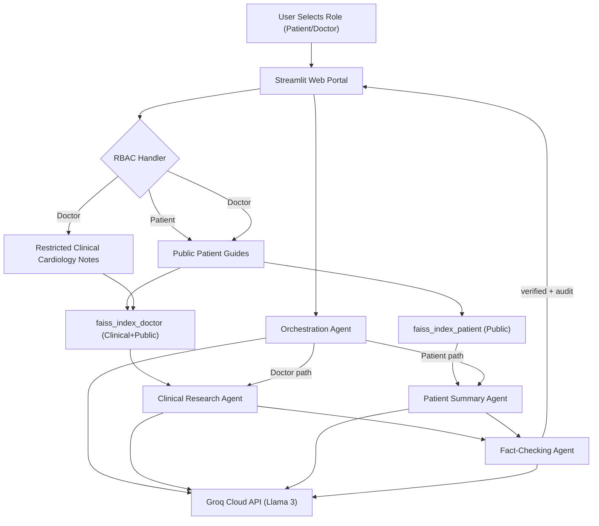

# DHANVA TEACH - Multi-Agent Healthcare RAG Portal

A production-ready Healthcare Retrieval-Augmented Generation (RAG) portal built using Python, Streamlit, and the Groq API (running Llama 3 models for ultra-fast medical inference). 

The system implements Role-Based Access Control (RBAC) to dynamically restrict clinical citations and technical medical analysis based on whether the logged-in user is a patient or an authorized medical practitioner (doctor).



---

## ⚙️ Core Architecture

The application has been modularized across separate files:
1. **Frontend View Controller (`app.py`)**: Hosts the primary dashboard layout, vibrant light-theme styling, logo brand asset, guide chatbot assistant, and file cataloging tables.
2. **Multi-Agent Engine (`agents/health_agents.py`)**: Hosts the four coordinating agents:
   - **Orchestration Agent**: Evaluates user profiles and matches routing protocols.
   - **Clinical Research Agent**: Deep technical medical analysis with ICD codes and clinical trials.
   - **Patient Summary Agent**: Renders clinical data into simple, empathetic, and actionable bullet points.
   - **Fact-Checking Agent**: Compares RAG vectors to responses to block hallucinated claims.
3. **Dual-FAISS RAG Pipeline (`utils/rag_pipeline.py`)**: Manages document reading (`pypdf`), local vector embeddings (`all-MiniLM-L6-v2`), and keeps two isolated FAISS index catalogs:
   - `faiss_index_patient`: Only ingests and retrieves patient-accessible public guides.
   - `faiss_index_doctor`: Ingests and retrieves both doctor-only files and public documents.
4. **RBAC State Handler (`utils/auth.py`)**: Houses roles state management.

---

## 🚀 Quick Start Setup

### 1. Configure the API Key
Copy the template secrets file and replace with your actual Groq API Key:
```bash
cp .streamlit/secrets.toml.template .streamlit/secrets.toml
```
Open `.streamlit/secrets.toml` and configure `GROQ_API_KEY`:
```toml
GROQ_API_KEY = "gsk_..."
```
*(Alternatively, you can type your Groq API Key directly in the sidebar input box at runtime.)*

### 2. Install Dependencies
Run the package installations:
```bash
pip install -r requirements.txt
```

### 3. Launch Streamlit Portal
Run the application local dev server:
```bash
streamlit run app.py
```

---

## 🔍 Validation Steps & Features

### 1. Sample Creator
- Once loaded, open the sidebar and click **Generate Sample Medical PDFs**.
- This creates two documents:
  - `clinical_cardiology_notes.pdf` (Doctor Only): Ingests technical cardiology findings (ICD-10 I42.1, EXPLORER-HCM trials, sarcomeric genetics).
  - `patient_hypertension_guide.pdf` (Public Patient): Ingests patient guidelines on blood pressure tracking, DASH diet, and sodium restrictions.

### 2. Verify Patient View
- Set the user role to **Normal Patient**.
- Go to **Patient Document Library** and notice only `patient_hypertension_guide.pdf` is visible. The cardiology research notes are hidden.
- Ask: *"What diet should I follow for blood pressure?"*
- Observe: The system streams a simple, warm response emphasizing DASH diet and sodium, showing a **✔ Verification Status: Grounded in Patient Records** check, without technical jargon or citations.

### 3. Verify Doctor View
- Switch the user role to **Authorized Medical Practitioner (Doctor)**.
- Notice both cardiology and hypertension files are displayed in the catalog.
- Ask: *"What are the genetic factors and clinical trials for hypertrophic cardiomyopathy?"*
- Observe: The system routes the query, prints the Orchestration routing reason, streams a highly technical response citing genetic mutations (MYBPC3, MYH7), ICD codes (I42.1), and trials (EXPLORER-HCM), and appends a detailed **Fact-Checker Audit Log** showing grounding analysis.
